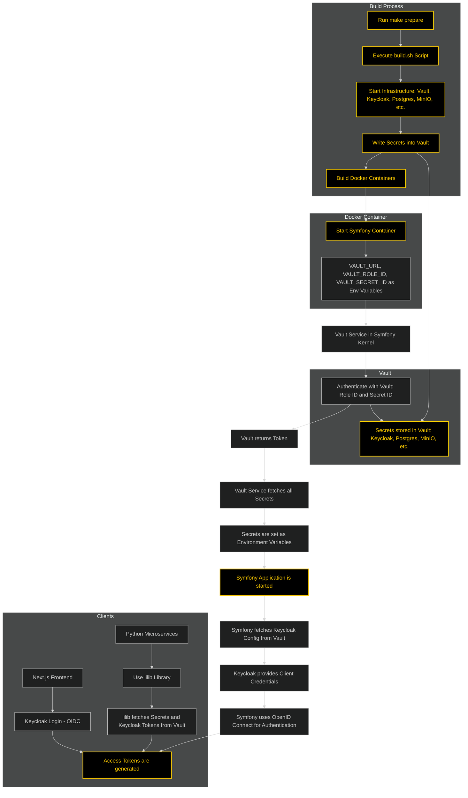
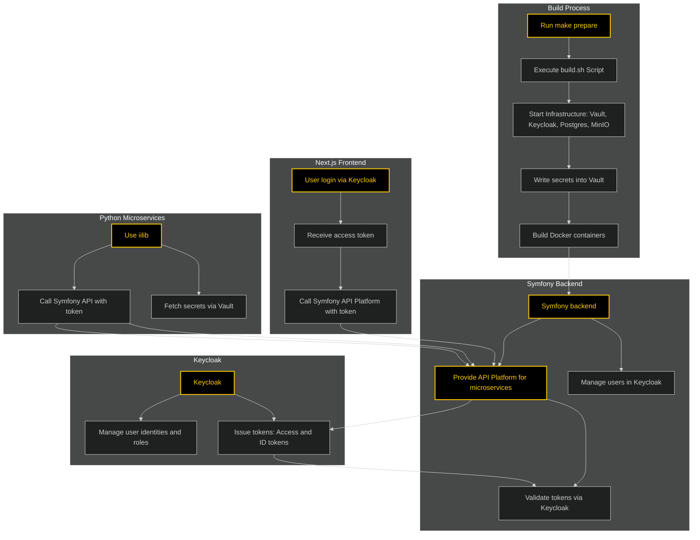
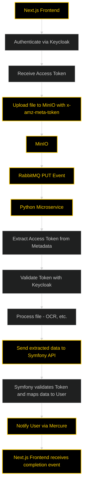

# Intelligent Intern Core

Welcome to **Intelligent Intern Core**, your one-stop solution for a fully automated infrastructure setup designed for highly scalable Symfony applications paired with Python microservices. This project is pre-configured to provide seamless integration between various services, reducing setup complexity and improving developer productivity.


### Prerequisites

- `make` utility

## Installing Make on Ubuntu

To install Make on Ubuntu, run the following command:

```bash
sudo apt update && sudo apt install -y make
```

## Intelligent Intern Core's build script ensures the following tools are installed:

- Docker and Docker Compose
- Python (for microservices)
- mkcert for self signed certificates - the authority is automatically added to chrome so it trusts the certs

---

## Overview











## Features

- **Automation**: Easy setup, deployment, and teardown using Make commands.
- **Pre-configured Services**:
    - Mercure
    - Vault
    - RabbitMQ
    - MinIO
    - Redis
    - Mailcatcher
    - Neo4j
    - Postgres with TimetableDB and PostGIS 
    - KeyCloak
- **Symfony and Python Integration**:
    - Symfony: Includes API Platform, Vault Bootstrapping instead of .env stuff, Keycloak integration, Logging to Grafana and Minio Integration via FlySystem  
    - Python: A base library for service connectivity is provided.
- **Comprehensive Testing**:
    - Unit, integration, and system tests.

The services are managed through Docker Compose for efficient deployment.

### Accessing the Repository
To access the `intelligent-intern` repository, contact the sales team at [sales@intelligent-intern.com](mailto:sales@intelligent-intern.com) for approval and to receive your customer number.

### Building and Running the Services
1. To build and start the services:
   ```bash
   make prepare
   ```
   
2. For subsequent runs without rebuilding:
   ```bash
   make run
   ```

### Initializing the Database
The database initializes automatically, creating tables for storing document metadata and analysis results.